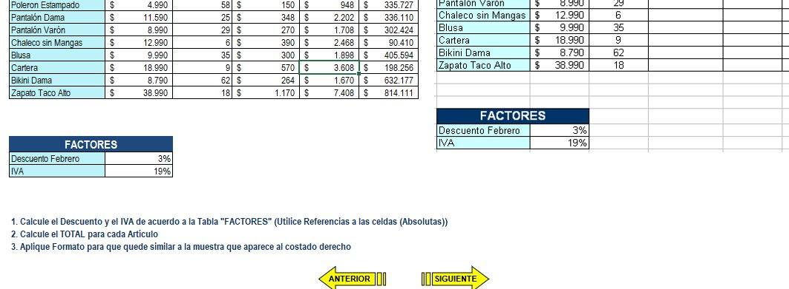
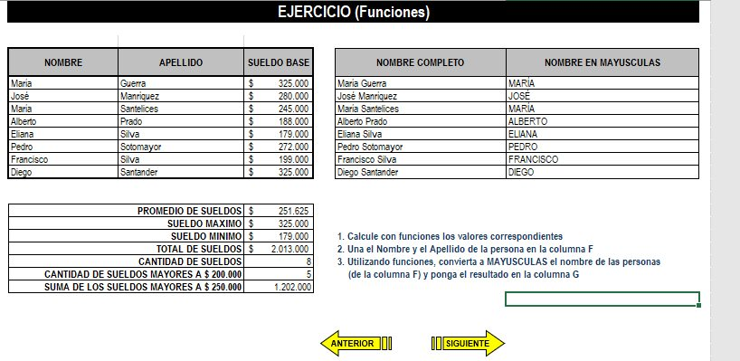
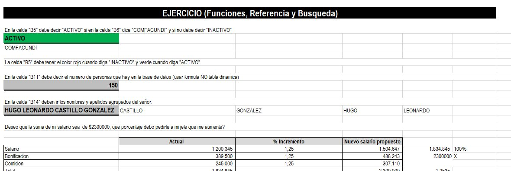
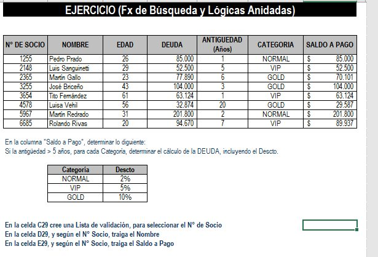

# Evaluación de EXCEL

# Targets

* Uso de referencias absolutas.
* Uso de funciones como CONCATENAR, SI, MAYUSC.
* Ordenar y filtrar.
* Uso de Formato condicional, Indice y Buscar V.
* Uso de tablas dinámicas.
* Uso de fórmulas lógicas anidadas.
* Uso de macros y filtro avanzado.

## Screenshot

